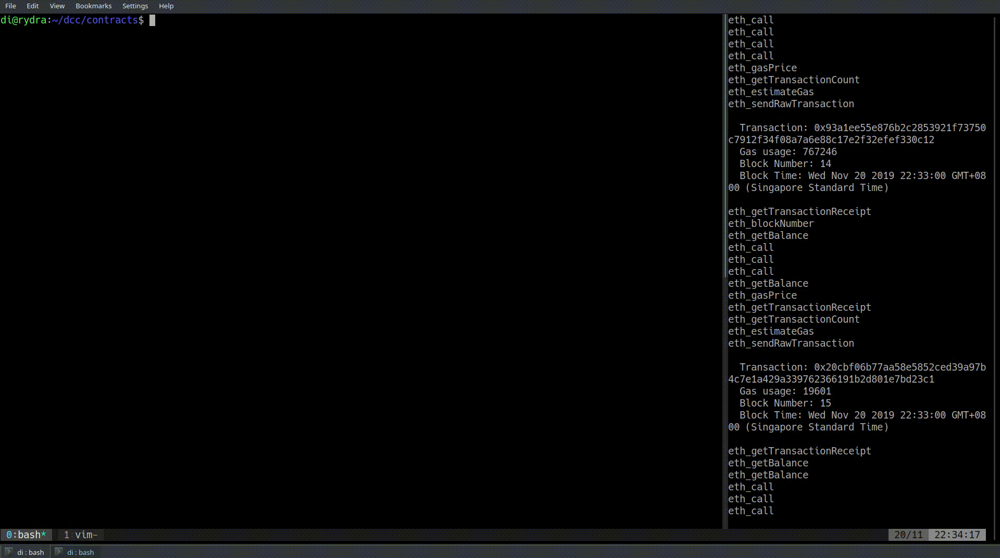

# Data Whistleblowing

This is a simple proof of concept of a data reporting and anonymous
whistleblowing mechanism.  Under the hood, it uses Ethereum smart contracts and
[Semaphore](https://github.com/kobigurk/semaphore), a zero-knowledge signalling
gadget.

While the core functionality is original, much of the scaffolding in this
repository is a fork of
[semaphore-ui](https://github.com/weijiekoh/semaphore-ui).

More information about Semaphore can be found
[here](https://medium.com/coinmonks/to-mixers-and-beyond-presenting-semaphore-a-privacy-gadget-built-on-ethereum-4c8b00857c9b).

- please find full write-up at https://github.com/openclimate-sg/whitepaper/wiki
- please find UI at https://github.com/openclimate-sg/datawhistleblowing_ui
- to interact with the main contract, `DataReporting.sol`, you can directly use the etherscan interface at https://kovan.etherscan.io/address/0x7B591C58f19292cE068b83375c470744B3a7eab1#writeContract


## Overview
For the purposes of this hackathon, we have implemented a simple proof of concept. We use as an example a solar energy farm which is required to report its daily power production. We also assume that this farm is a corporation with 5 executives.

Each executive registers their cryptographic identity into an Ethereum smart contract (based on Semaphore (https://weijiekoh.github.io/semaphore-ui/, https://github.com/kobigurk/semaphore/), a zero-knowledge signalling gadget), so that anyone can anonymously prove their membership in the set and broadcast a whistleblowing signal.



We then simulate the following process of the company reporting data, along with a deposit, for five days in a row, and an executive anonymously blowing the whistle on data reported on the fifth day. This locks up part of the total deposit. After an investigation (outside the system), an investigator then seizes part of the total amount deposited, and rewards part of the seized funds to a separate address specified by the whistleblower when she blew the whistle earlier.

## Demo
1. On day 1, the solar farm publishes their true power readings on a smart contract and deposits 0.1 ETH along with the data.
2. The solar farm does the same for days 2, 3, and 4.
3. On day 5, however, the solar farm reports false power readings.
4. Alice, an executive in the corporation, decides to blow the whistle on this false reading. She produces a zero-knowledge proof of her membership in the set of executives, states that the readings of day 5 are fraudulent, and publishes it. Most importantly, the proof does not reveal Alice’s identity.
5. The smart contract locks up 0.2 ETH of deposits pending the results of an external investigation.
6. We assume that the investigator is a trusted third party. They hold the administrative private key with which they can unlock the farm’s deposit, or trigger the confiscation of said funds. Alice is rewarded a portion of the deposit for correctly whistleblowing, with this portion determined by the rules agreed upon, and saved in the smart contract. In this demo, she is rewarded 0.1 ETH. For the sake of anonymity, we assume that her payout address, specified along with the zero-knowledge proof, is unlinked to the address used to register her identity.


## Local development and testing

These instructions have been tested with Ubuntu 18.0.4 and Node 11.14.0.

### Requirements

- Node v11.14.0.
      - We recommend [`nvm`](https://github.com/nvm-sh/nvm) to manage your Node
        installation.

### Local development

Install `npx`:

```bash
npm install -g npx
```

Clone this repository and its `semaphore` submodule:

```bash
git clone git@github.com:weijiekoh/datawhistleblowing.git && \
cd datawhistleblowing && \
git submodule update --init
```

Download the circuit, keys, and verifier contract. Doing this instead of
generating your own keys will save you about 20 minutes. Note that these are
not for production use as there is no guarantee that the toxic waste was
discarded.

```bash
./scripts/downloadSnarks.sh
```

Install all dependencies and build the source code:

```bash
npm i &&
npm run bootstrap &&
npm run build
```

In a separate terminal, navigate to `contracts` and launch Ganache:

```bash
cd contracts
npm run ganache
```

Staying inside the `contracts` directory, run the demo script. You need an
[`solc`](https://github.com/ethereum/solidity) 0.5.X binary somewhere in your
filesystem.

```bash
node build/run.js -s /path/to/solc -o ./abi -i ./sol/
```
